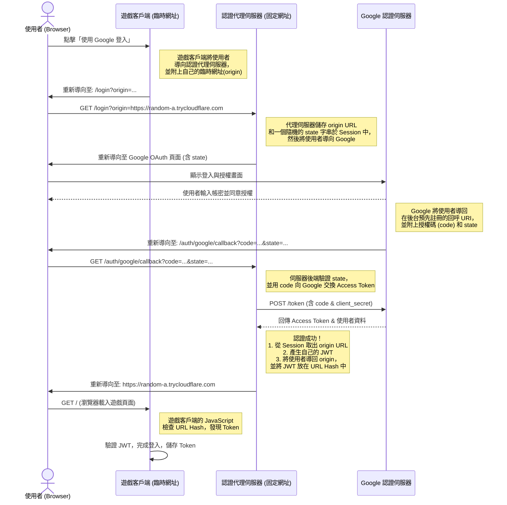

# 遊戲認證代理伺服器 (Auth Proxy) 設計說明

本文檔旨在說明如何為一個可由多位使用者自行託管（Self-Hosted）的網頁遊戲，設計一套集中式的 Google OAuth 登入認證系統。

## 1. 核心問題：分散式服務與集中式認證

我們的麻將遊戲專案面臨一個特殊的挑戰：

*   **分散式託管**：任何一位玩家（遊戲主機）都可以在自己的電腦上啟動遊戲服務，並透過 Cloudflare Tunnel 產生一個**隨機、臨時的公開網址**（例如 `https://random-name.trycloudflare.com`）。
*   **集中式認證**：整個專案共用一個在 Google Cloud Console 建立的 OAuth 2.0 用戶端 ID。
*   **OAuth 安全限制**：Google 要求開發者必須預先註冊一個或多個**固定的、精確匹配的**重新導向 URI (Redirect URI)。

這兩點產生了根本性的矛盾：一個需要**動態、隨機網址**的系統，無法與一個只信任**靜態、固定網址**的認證服務直接整合。

## 2. 解決方案：認證代理 (Auth Proxy) 模式

為了解決這個問題，我們引入一個中介層，稱為**認證代理伺服器 (Auth Proxy)**。

這個代理伺服器的核心思想是：**將所有與 Google 的認證通訊全部集中到一個我們自己控制的、擁有固定網址的伺服器上。**

*   **單一職責**：它的唯一工作就是處理登入請求、與 Google 互動，並將結果安全地傳回給最初發起請求的遊戲客戶端。
*   **固定入口**：這個代理伺服器會被部署在一個固定的網址上，例如 `https://auth.my-mahjong-game.com`。在 Google Cloud Console 中，我們**唯一需要註冊**的重新導向 URI 就是這個代理伺服器的回呼網址（例如 `https://auth.my-mahjong-game.com/auth/google/callback`）。
*   **解耦合**：遊戲客戶端本身不再關心 Google OAuth 的複雜流程，它只需要知道如何請求登入和接收最終的認證結果即可。

## 3. 認證流程詳解 (Mermaid 圖)

以下是整個認證流程的時序圖：



## 4. 系統元件設計

### 4.1. 遊戲客戶端 (Mahjong Game Client)

前端需要進行以下調整：

1.  **修改登入按鈕**：
    *   原本觸發 Google 登入的按鈕，現在的連結目標應改為認證代理伺服器。
    *   必須在連結中動態附上 `origin` 參數，其值為當前遊戲客戶端的完整網址 (`window.location.origin`)。
    *   **範例**：
        ```javascript
        const authServerUrl = 'https://auth.my-mahjong-game.com/login';
        const origin = window.location.origin;
        const loginUrl = `${authServerUrl}?origin=${encodeURIComponent(origin)}`;
        
        // 將此 loginUrl 賦予登入按鈕
        document.getElementById('login-btn').href = loginUrl;
        ```

2.  **增加 Token 接收邏輯**：
    *   在遊戲頁面載入時，加入一段 JavaScript 程式碼，用來檢查 URL 的片段識別碼 (hash)。
    *   如果 hash 中包含 `#token=...`，就解析出這個 JWT，並將它儲存到 `localStorage` 中。
    *   清除 URL 中的 hash，避免 Token 洩漏。
    *   **範例**：
        ```javascript
        window.addEventListener('load', () => {
          if (window.location.hash.startsWith('#token=')) {
            const token = window.location.hash.substring(7); // 移除 '#token='
            localStorage.setItem('game_auth_token', token);
            
            // 清理 URL
            window.history.replaceState(null, '', window.location.pathname + window.location.search);

            // 使用 token 進行後續操作，例如更新 UI
            console.log('登入成功！');
          }
        });
        ```

### 4.2. 認證代理伺服器 (Auth Proxy Server)

這是一個全新的、獨立的後端應用，可以使用 Node.js (Express/Fastify) 或 Python (Flask/FastAPI) 等輕量級框架快速開發。

它至少需要以下兩個 API 端點：

1.  **`GET /login`**
    *   **功能**：處理登入請求的入口。
    *   **邏輯**：
        1.  從查詢參數 (Query Parameter) 中讀取 `origin`，並將其**儲存在伺服器的 Session 中**。
        2.  產生一個**隨機、無法猜測的 `state` 字串**，也儲存在 Session 中（用於 CSRF 防護）。
        3.  建構導向 Google OAuth 頁面的 URL，並附上您的 `client_id`、`redirect_uri`、`scope` 以及剛剛產生的 `state`。
        4.  回傳 HTTP 302 重新導向回應，將使用者瀏覽器導向 Google。

2.  **`GET /auth/google/callback`**
    *   **功能**：接收 Google 重新導向回來的請求。這也是您在 Google 後台唯一需要註冊的 URI。
    *   **邏輯**：
        1.  從查詢參數中讀取 `code` 和 `state`。
        2.  **驗證 `state`**：將收到的 `state` 與儲存在 Session 中的 `state` 進行比對。如果不符，立即中止流程並回報錯誤。
        3.  向 Google 的 Token 端點發起一個**伺服器對伺服器**的 POST 請求，傳送 `code`、`client_id`、`client_secret` 和 `redirect_uri`。
        4.  成功後會收到 Google 回傳的 `access_token`。
        5.  使用 `access_token` 呼叫 Google 的使用者資訊 API，獲取使用者的 Google ID、姓名、頭像等。
        6.  從 Session 中讀取先前儲存的 `origin` 網址。
        7.  **產生您自己的 JWT**：使用一個僅有您的代理伺服器知道的密鑰 (Secret Key)，將使用者資訊（例如 Google ID、姓名）簽署成一個 JWT。
        8.  回傳 HTTP 302 重新導向回應，將使用者導回 `origin` 網址，並將 JWT 放在 URL 的 hash 中：`${origin}#token=${your_jwt}`。

### 4.3. 安全性考量：JWT 與 State

*   **State**：`state` 參數是 OAuth 2.0 中對抗**跨站請求偽造 (CSRF)** 的核心機制，務必實作。
*   **JWT (JSON Web Token)**：由您的代理伺服器簽發的 JWT，是遊戲客戶端與遊戲伺服器之間信任的憑證。
    *   **簽名 (Signature)**：JWT 必須使用密鑰簽名。遊戲伺服器需要能用此密鑰（或對應的公鑰）來驗證 JWT 的真實性，確保它確實是由您的認證代理伺服器所簽發，且內容未被竄改。
    *   **宣告 (Claims)**：JWT 的內容（Payload）應包含足夠的資訊，如 `userId` (使用者的 Google ID)、`name`、`picture` 以及一個**過期時間 `exp`**，以控制 Token 的有效期。

## 5. 總結

透過建立一個認證代理伺服器，我們將動態、不可信的遊戲客戶端與需要靜態、可信網址的 Google OAuth 服務完全解耦。這不僅解決了技術上的矛盾，更建立了一個安全、可擴展的標準認證架構，同時保持了使用者透過連結快速加入遊戲的良好體驗。
